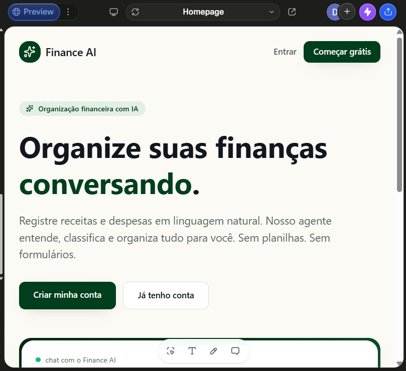
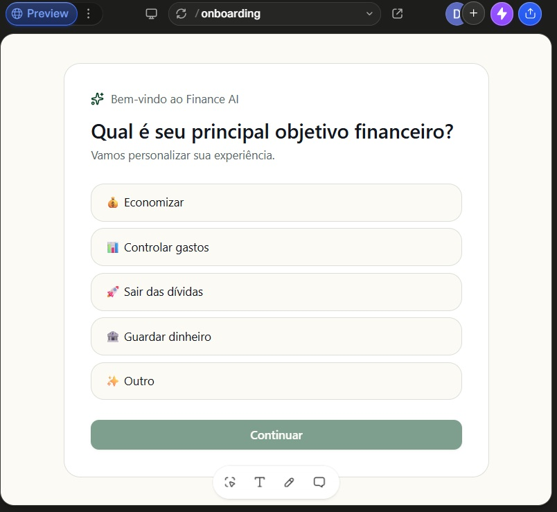
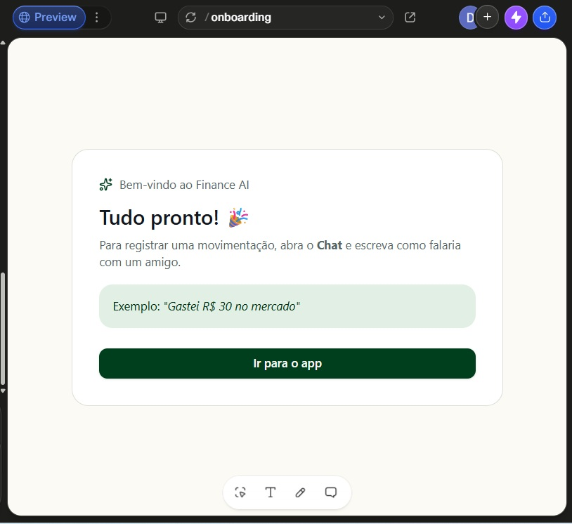
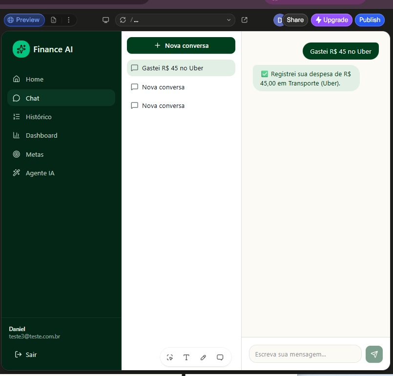
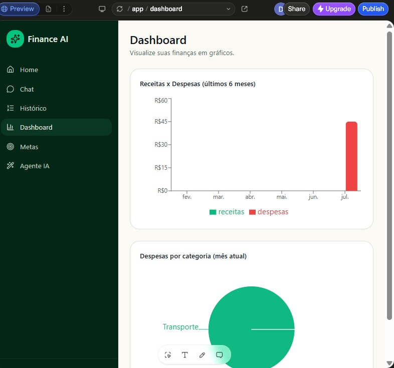
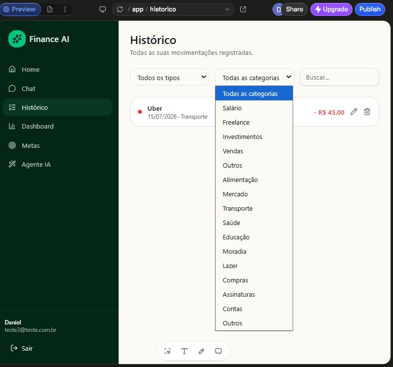

# DIO - 
Criando um APP de Organização de Finanças Pessoais com Vibe Coding

Estes são os arquivos e os prompts utilizados para criar a aplicação de Criando um APP de Organização de Finanças Pessoais com Vibe Coding. Este foi o desafio do bootcamp Riachuelo - Criando produtos com IA, feito pela DIO em julho de 2026. O aplicativo foi criado usando o Lovable

O objetivo do sistema é permitir que o usuário registre despesas e receitas por meio de mensagens em linguagem natural, receba classificação automática, acompanhe seu saldo e obtenha recomendações simples para melhorar sua saúde financeira.

Os prompts utilizados ficam na pasta /prompts.

A seguir, telas do sistema.

